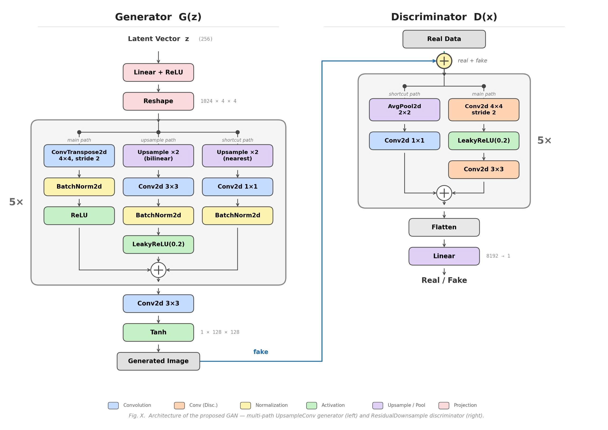
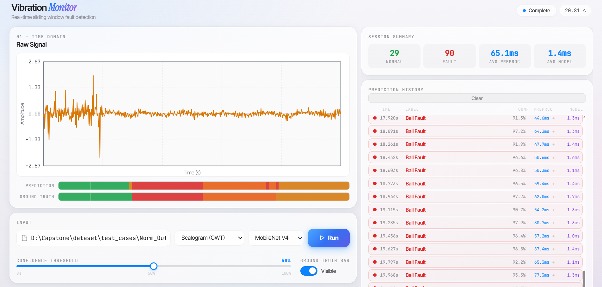

# Rolling Bearing Fault Diagnosis under Data Imbalance using WGAN-GP Data Augmentation and Concise CNN

**WGAN-GP · CWT · STFT · MobileNetV4 · GhostNetV3 · TinyNetD · EdgeNeXtXXS · ONNX INT8**

[	](https://www.python.org/)[	](https://pytorch.org/)[	](https://onnxruntime.ai/)[	](https://fastapi.tiangolo.com/)	

---

## Overview

This project implements an end-to-end predictive maintenance pipeline designed to mitigate the **class-imbalance** inherent in the CWRU Bearing Dataset. By leveraging  **Wasserstein GAN with Gradient Penalty (WGAN-GP)** , the system synthesizes high-fidelity training data to ensure minority fault classes are robustly represented, significantly improving classifier generalization. To extract deep discriminative features, raw 1D vibration signals are transformed into 2D time-frequency representations using **Scalograms (CWT)** and  **Spectrograms (STFT)** . The framework evaluates four lightweight CNN architectures optimized for industrial edge deployment; these models are compressed via **INT8 quantization** and exported to the **ONNX** format to achieve high-throughput, low-latency inference. The final deployment features a **real-time sliding-window monitor** and a web-based UI, enabling continuous health monitoring and instantaneous fault detection in rotating machinery.

---

## Dataset — CWRU Bearing

|      Class      | Label |      Description      |
| :--------------: | :---: | :-------------------: |
|      Normal      |   0   |   Healthy Condition   |
| Outer Race Fault |   1   |   Outer Race Fault   |
| Inner Race Fault |   2   |   Inner Race Fault   |
|    Ball Fault    |   3   | Rolling Element Fault |

- Sampling rate: **12,000 Hz**
- Window size: **2,048 samples** (≈ 171 ms per segment)
- Each window is converted to a **128 × 128** grayscale image

---

## Signal-to-Image Transforms

### Scalogram — Continuous Wavelet Transform (CWT)

```
Signal → z-score normalize → pywt.cwt (Morlet, scales 1–128)
       → log1p magnitude → min-max normalize → 128×128 image
```

### Spectrogram — Short-Time Fourier Transform (STFT)

```
Signal → z-score normalize → scipy.signal.stft (Hann, nperseg=256, noverlap=128)
       → log1p magnitude → min-max normalize → 128×128 image
```

---

## WGAN-GP Architecture



---

## WGAN-GP

| Hyperparameter                       | Value                                    |
| ------------------------------------ | ---------------------------------------- |
| Gradient penalty weight (λ)         | 10                                       |
| Critic iterations per generator step | 5                                        |
| GAN evaluation metric                | FID, KID                                 |
| Output                               | Synthetic scalogram / spectrogram images |

---

## CNN Models

Eight model variants are produced — each of the four architectures trained on both preprocessing types:

| Architecture | Preprocessing | Format    |
| ------------ | ------------- | --------- |
| MobileNetV4  | Scalogram     | ONNX INT8 |
| MobileNetV4  | Spectrogram   | ONNX INT8 |
| GhostNetV3   | Scalogram     | ONNX INT8 |
| GhostNetV3   | Spectrogram   | ONNX INT8 |
| TinyNetD     | Scalogram     | ONNX INT8 |
| TinyNetD     | Spectrogram   | ONNX INT8 |
| EdgeNeXtXXS  | Scalogram     | ONNX INT8 |
| EdgeNeXtXXS  | Spectrogram   | ONNX INT8 |

### Training Features

- Mixed-precision training (AMP) with gradient clipping
- Early stopping with patience = 10 epochs
- Learning rate scheduling using Cosine Annealing
- Full academic evaluation suite:

| Metric                  | Description                      |
| ----------------------- | -------------------------------- |
| Accuracy                | Overall classification accuracy  |
| Precision / Recall / F1 | Macro-averaged                   |
| AUC-ROC                 | One-vs-rest, macro               |
| Cohen's κ              | Agreement beyond chance          |
| MCC                     | Matthews Correlation Coefficient |

---

## Real-Time Monitor

The monitor streams sliding-window predictions over a MATLAB `.mat` signal file, displaying results live in the browser.

**Launch:**

```bash
uvicorn monitor.app.main:app --reload --port 8000
```

Then open [http://127.0.0.1:8000](http://127.0.0.1:8000).

### UI Features



| Panel              | Description                                                            |
| ------------------ | ---------------------------------------------------------------------- |
| Raw Signal         | Time-domain waveform plot                                              |
| Prediction Bar     | Per-window predicted class, color-coded                                |
| Ground Truth Bar   | True labels (when available in `.mat`)                               |
| Session Summary    | Normal count, Fault count, Avg preproc time, Avg model time            |
| Prediction History | Scrollable log — timestamp, label, confidence %, preproc ms, model ms |

### Inference Settings

| Setting              | Options                                                                   |
| -------------------- | ------------------------------------------------------------------------- |
| Transform            | Scalogram (CWT) · Spectrogram (STFT)                                     |
| Model                | MobileNetV4 · GhostNetV3 · TinyNetD · EdgeNeXtXXS                      |
| Confidence Threshold | 0 – 100 % (default 80%) — low-confidence windows fall back to*Normal* |
| Ground Truth Bar     | Toggle visibility                                                         |

## Project Structure

```
Repository/
├── src/
│   ├── data/               # CWRU loader, dataset classes, test-case generator
│   ├── features/
│   │   ├── scalogram.py    # CWT → 128×128 image
│   │   └── spectrogram.py  # STFT → 128×128 image
│   ├── models/
│   │   ├── architecture/   # WGAN-GP Generator & Discriminator, CNN backbones
│   │   └── onnx/           # ONNX inference wrapper
│   ├── training/
│   │   ├── trainer_wgan_gp.py      # WGAN-GP trainer (FID/KID eval, GIF export)
│   │   └── trainer_classifier.py   # CNN trainer (AMP, early stopping, plots)
│   ├── evaluation/         # FID, KID metrics
│   └── utils/
├── monitor/
│   └── app/
│       ├── main.py         # FastAPI app entry point
│       ├── router.py       # SSE stream, sliding-window inference
│       └── static/         # index.html + monitor.js (web UI)
├── dataset/
│   ├── processed/          # Scalogram & Spectrogram .pt tensors (train/val/test)
│   └── generated/          # WGAN-GP synthetic .pt tensors per class
├── models/
│   └── ONNX/CNN/           # Exported ONNX INT8 models (SCALOGRAM / SPECTROGRAM)
├── notebooks/              # Experiment notebooks
└── requirements.txt
```

---

## Installation

```bash
pip install -r requirements.txt
```

**Dependencies:**

| Package     | Version |
| ----------- | ------- |
| fastapi     | 0.121.1 |
| uvicorn     | latest  |
| onnxruntime | 1.24.4  |
| numpy       | 2.4.4   |
| scipy       | 1.17.1  |
| pywavelets  | 1.7.0   |
| pydantic    | 2.12.4  |
| pillow      | 12.1.1  |

---

## Notebooks

Jupyter notebooks covering the full workflow — preprocessing, WGAN-GP training, CNN training, ONNX export — are available in the [`notebooks/`](notebooks/) directory.
